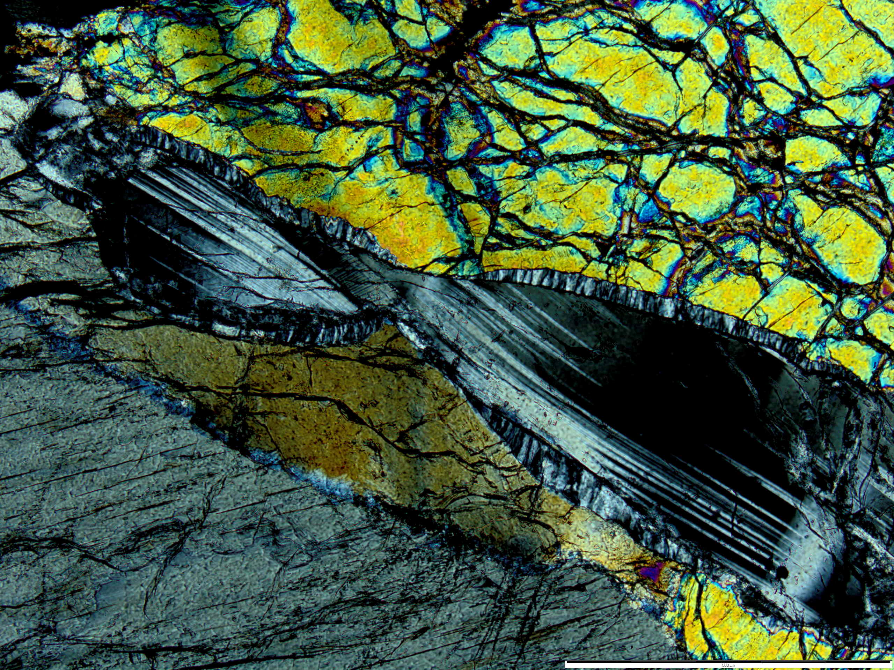
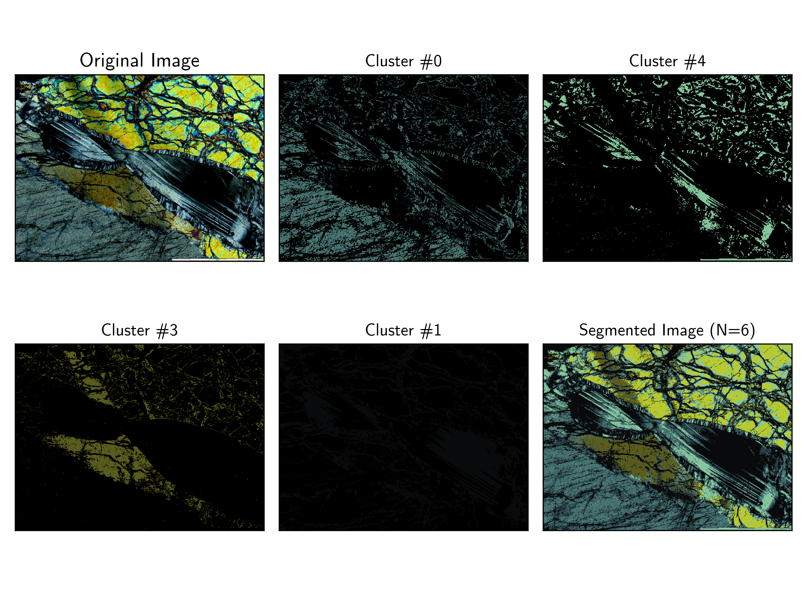
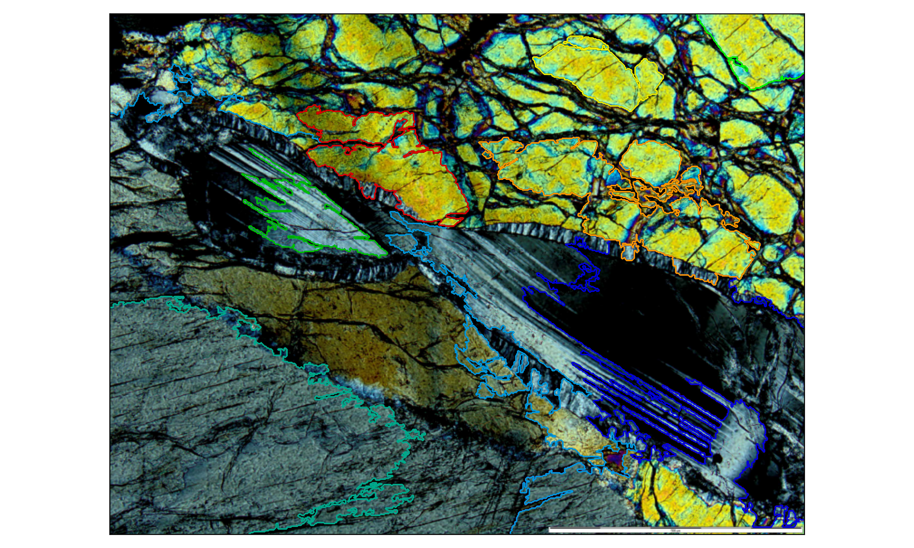

# Extracting Minerals with Unsupervised Learning

Two friends, [Manon Bickert](https://www.researchgate.net/profile/Manon_Bickert) and [Marine Paquet](https://www.researchgate.net/profile/Marine_Paquet) have exhibited, in the Insitut de
Physique du Globe de Paris, a collection of pictures of minerals through the
lens of a microscope. I have seen that machine learning algorithms can be applied
to a lot of different images to create clusters and classify the pixels.

I have found two way to separate them so far:
- the  `k-means` algorithm
- the `agglomerative-clustering` algorithm

These two approaches come from the [scikit-learn](https://scikit-learn.org/stable/index.html) package, so make sure you have it installed before starting.

I've been using the following example but these codes should work with any kind of pictures:

The `k-means` will cluster minerals of similar color wherever they are in the figure (here for `n_cluster = 6`):

The `agglomerative-clustering` will cluster minerals of similar color only if they are close to each other (here for `n_cluster = 10`):

